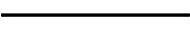
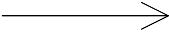
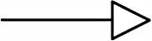
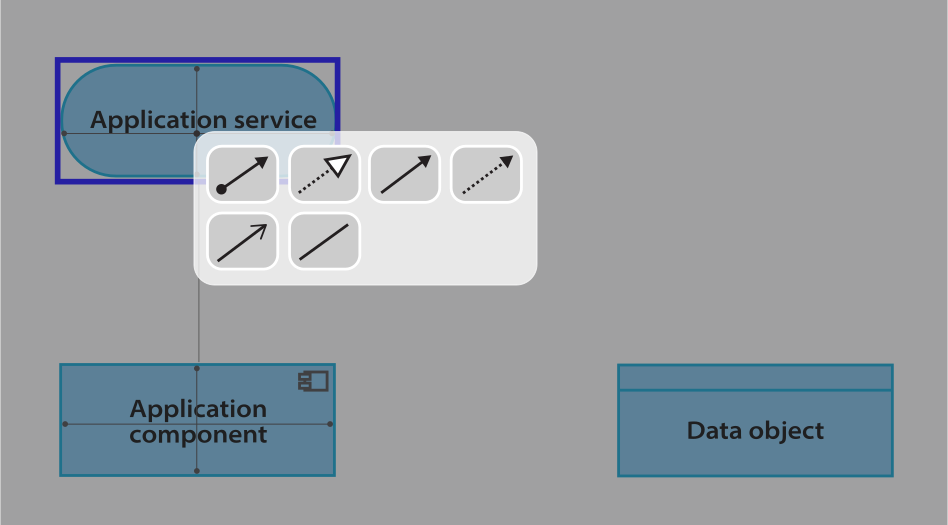

# Can Machine Learning improve Enterprise Architecture Models?

Machine learning (ML) is a branch of artificial intelligence aimed at the automatic extraction of insights from data. Typically lots of data is thrown at an algorithm to discover patterns and make predictions for new cases. ML is already being applied in many different domains to support humans in their tasks and decision. Examples include financial institutions using ML to detect potential cases of fraud. Online retailers use ML to recommend relevant products to their customers. And in logistics ML is used to predict demand and plan capacity. 

At [Bizzdesign](http://www.bizzdesign.com/) we are also exploring how machine learning can help us to improve the user experience for enterprise architecture designers and consumers on the [Horizzon platform](https://bizzdesign.com/platform/platform-overview/). A first machine learning-based feature, the **Relation Recommender for ArchiMate**, was recently [announced](https://bizzdesign.com/blog/how-machine-learning-improves-enterprise-architecture-models/), and is now available for customers to try out. In this article, I will explain what it is, how you can use it in Enterprise Studio, and, for the ML-enthusiasts, also how it works under the hood.

## A Relation Recommender for ArchiMate

[ArchiMate]((https://publications.opengroup.org/archimate-library)) is a powerful, graphical modelling language for enterprise architecture, standardized by the [Open Group](https://www.opengroup.org/), and the most widely used language on our platform. ArchiMate provides concepts for capturing an enterprise's strategy, business, application and technology designs. ArchiMate also provides 11 different relation types to express the relationships between objects, which are listed in the table below. 


| Relation       | Representation |
| -------------- | -------------- |
| Access         |  |
| Aggregation    |  |
| Assignment     |  |
| Association    |  |
| Composition    |  |
| Flow           |  |
| Influence      |  |
| Realization    |  |
| Serving        |  |
| Specialization |  |
| Triggering     |  |


The richness of the ArchiMate language enables accurate modelling, but it could also be challenging for beginners and occasional modellers. How do you decide on the most appropriate relation between two objects in your model? This requires training and experience. Bizzdesign's tools already help you by blocking the creation of relations that are not allowed according to the ArchiMate metamodel, and by only suggesting 'legal' relations when using the [Smart Connector](https://support.bizzdesign.com/display/knowledge/Creating+objects+and+relations#Creatingobjectsandrelations--1724456068Usingthesmartconnector). However, there are often still many options to choose from. The right choice depends on your organization's modelling guidelines and conventions, and on your intention as a modeller.

|  |
| :---: |
| _The Smart Connector only proposes relations that are allowed on the current view type, and between the selected source and target object types_ |


Bring in the ML-powered Smart Connector. When you switch on the new Relation Recommender, the Smart Connector becomes even smarter. It picks the most appropriate relation type for you depending on what it learned from the content already in your model package. You just connect the objects you want to relate, and the Smart Connector will add the relation that matches your organization's best practice for the given context. 

Now that you don't have to think about the relation type anymore, you can model much faster. Also, your less experienced colleague can add relations to the models without having to worry about using the right relation type, thereby increasing their quality and conformance to your modelling guidelines. And, don't worry. If you disagree with the selection made by the algorithm, you can always change the relation type afterward using the context menu. Also, if the algorithm accidentally picks a relation type that is not allowed according to the metamodel, for example because it has not seen enough examples during its training, the Smart Connector falls back to its default behavior and asks you to choose.


## Try it out for yourself

The Relation Recommender for ArchiMate is currently in a _beta_ testing phase. You can try it out following the instructions below. We would like to know how you experience this machine-learning supported way of modelling. Is the Relation Recommender helping you to model better and faster? Would this feature help your less experienced colleagues to model correctly in ArchiMate? Let us know via the [Bizzdesign Community](https://bizzdesign.com/community/). 

1. Select the model package you want the Relation Recommender to be trained on. By training the recommender on your own model package, we can ensure that it learns about the conventions and best practices in your organization. This package should contain sufficient examples of relations, typically in the order of `10,000`s, and with sufficient variety. 
1. Request us via [Bizzdesign Support](https://support.bizzdesign.com/) to enable the Relation Recommender for your environment, and supply them the identifier of your model package.
1. Once the Relation Recommender is enabled on your Horizzon server, each user can choose to switch it on in the Enterprise Studio Options > Advanced > Machine learning (BETA) > Use relation recommender (when available).

    '")

1. Now create a relation using the Smart Connector and see how the Relation Recommender picks a relation type for you.


## Training your own relation recommender

If you are interested in machine learning, you can follow the instructions below to create your own relation recommender. Can you increase the performance and accuracy even further?

### Project setup

- Clone the following github repository and CD into it:

  ```
  git clone git@github.com:m-steen/ml4ea.git
  cd ml4ea
  ```

  Alternatively, first create your own fork in github and clone that one.

- Verify your Python installation

  ```
  python --version
  ```

  If you don't have Python or its version is lower than 3.7, install or upgrade Python.

- Create a virtual environment

  ```
  python -m venv .venv
  ```

- Activate the virtual environment

  You need to do this every time you work with this project, otherwise the required python libraries cannot be found.

  On macOS and Linux:
  ```
  source .venv/Scripts/activate
  ```

  On Windows:
  ```
  .\.venv\Scripts\activate
  ```

- Install the required libraries:

  ```
  pip install -r requirements.txt
  ```

- Git configuration

  _This step is only necessary if you intend to make changes and contribute them._

  Configure git to clear the output of Jupyter Notebooks before committing them:

  ```
  git config --local include.path ../.gitconfig
  ```

### Generate a dataset

Before you can train your own relation recommender, you need a dataset with example relations to train the recommender on.

The [`scripts/`](scripts/) folder in the ml4ea code repository contains a [script](scripts/generate_training_data.script) that can be executed in Enterprise Studio to generate a dataset based on your own model package. After generating, copy the output of the script to a CSV file in the [`data/`](data/) folder of this project.

To start with, we have selected the following features:

- **sourceType**: the type of the source object of the relation;
- **targetType**: the type of the target object;
- **viewType**: the type of the view on which the relation appears.

The target for our predictions is:

- **relationType**: the type of the relation, being one of the 11 different ArchiMate relation types.

### Running the Jupyter notebook

We have prepared a [Jupyter notebook](RelationRecommenderNotebook.ipynb) which you can use to perform all the steps necessary to create your own relation recommender:
- read and pre-process the training data, 
- train the recommender, and
- evaluate and test the recommender.

To run the notebook, first start the Jupyter notebook server locally by executing the following on the command line:

```
jupyter notebook
```

Then open a browser at [localhost:8888](http://localhost:8888/), and open the RelationRecommenderNotebook. The notebook is pretty self-descriptive. Execute each step by selecting it and pressing **Shift**+**Enter**. 

## Next steps
After you have executed all the steps of the notebook, you can try to improve the accuracy of the recommendations. For example, you could try a different algorithm, or different training parameters. Another option is to include additional features in the dataset. What features would be good predictors for the relation type?

Share your results with us at our community site or by making a pull request to the github repository.
