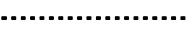
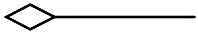
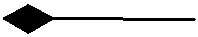
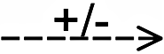
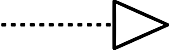

# Machine Learning for Enterprise Architecture

Machine learning (ML) is a branch of artificial intelligence where lots of data is thrown at an algorithm to discover patterns and make predictions for new cases. Financial institutions use ML to detect potential cases of fraud. Online retailers use ML to recommend relevant products to their customers. And in logistics ML is used to predict demand and plan capacity, to name just a few possible applications. 

At Bizzdesign we are also exploring how machine learning can help us to improve the user experience for enterprise architecture designers and consumers on the Horizzon platform. The first machine learning-based feature, the Relation Recommender for ArchiMate, is now available for customers to try out. In this article, I will explain what it is, how you can use it in Enterprise Studio, and, for the ML-enthusiasts, also how it works behind the scenes.

## A Relation Recommender for ArchiMate

[ArchiMate]((https://publications.opengroup.org/archimate-library)) is a powerful, graphical modelling language for enterprise architecture, standardized by the [Open Group](https://www.opengroup.org/), and the most widely used language on our platform. ArchiMate provides concepts for capturing an enterprise's strategy, business, application and technology designs. In order to express the relationships between objects, ArchiMate also provides 11 different relation types, which are listed in the table below. 

| Relation       | Representation |
| -------------- | -------------- |
| Access         |  |
| Aggregation    |  |
| Assignment     |  |
| Association    |  |
| Composition    |  |
| Flow           |  |
| Influence      |  |
| Realization    |  |
| Serving        |  |
| Specialization |  |
| Triggering     |  |

The richness of the ArchiMate language enables for very precise models, but is also a challenge for beginners and occasional modellers. How do you decide which is the most appropriate relation between two objects in your model? This requires training and experience. Luckily, Bizzdesign's tools already help you by blocking the creation of relations that are not allowed according to the ArchiMate metamodel, and by only suggesting 'legal' relations when using the Smart Connector. However, there still can be many options to choose from, and then the right choice depends on your organization's modelling guidelines and conventions, and on your intention as a modeller.

The Smart Connector only proposes relations that are allowed on the current view type, and between the selected source and target object types:

Bring in the ML-powered smart connector. When you switch on the new Relation Recommender, the smart connector becomes even smarter. It will then pick the most appropriate relation type for you depending on what it learned from the content already in your model package. You just connect the objects you want to relate, and the smart connector will add the relation that matches your organization's best practice for the given context. Now that you don't have to think about the relation type anymore, you can model much faster than before. Also, your less experienced colleague can now add relations to the models without having to worry about using the right relation type, increasing their quality and conformance to your modelling guidelines. And, don't worry. If you do not agree with the selection made by the algorithm, you can always change the relation type afterwards using the context menu. Also, if the algorithm accidentally picks a relation type that is not allowed according to the metamodel, for example because it has not seen enough examples during it training, the smart connector will fall back to its default behavior and ask you to choose.

## Try it out for yourself

The Relation Recommender for ArchiMate is currently in a Beta testing phase. You can try it out following the instructions below. We would very much like to know how you experience it. Do you feel the Relation Recommender is helping you to model better and faster? Would this feature help your less experienced colleagues to model correctly in ArchiMate? Let us know via the [Bizzdesign Community](https://bizzdesign.com/community/). 

1. Select the model package you want the Relation Recommender to be trained on. By training the recommender on your own model package, we can ensure that it learns about the conventions and best practices in your organization. This package should contain sufficient examples of relations, typically in the order of `10,000`s, and with sufficient variety. 
1. Request us via [Bizzdesign Support](https://support.bizzdesign.com/) to enable the Relation Recommender for your environment, and supply them the identifier of your model package.
1. Once the Relation Recommender is enabled on your Horizzon server, each user can choose to switch it on in the Enterprise Studio Options > Advanced > Machine learning (BETA) > Use relation recommender (when available).

    '")

1. Now create a relation using the Smart Connector and see how the Relation Recommender picks a relation type for you.

